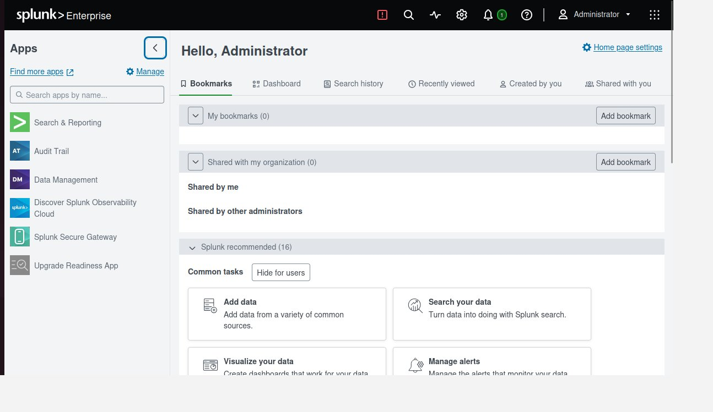
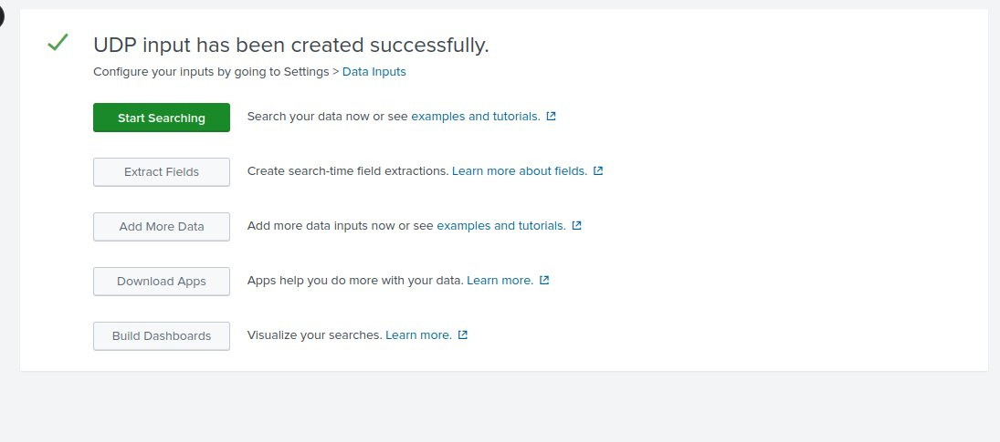
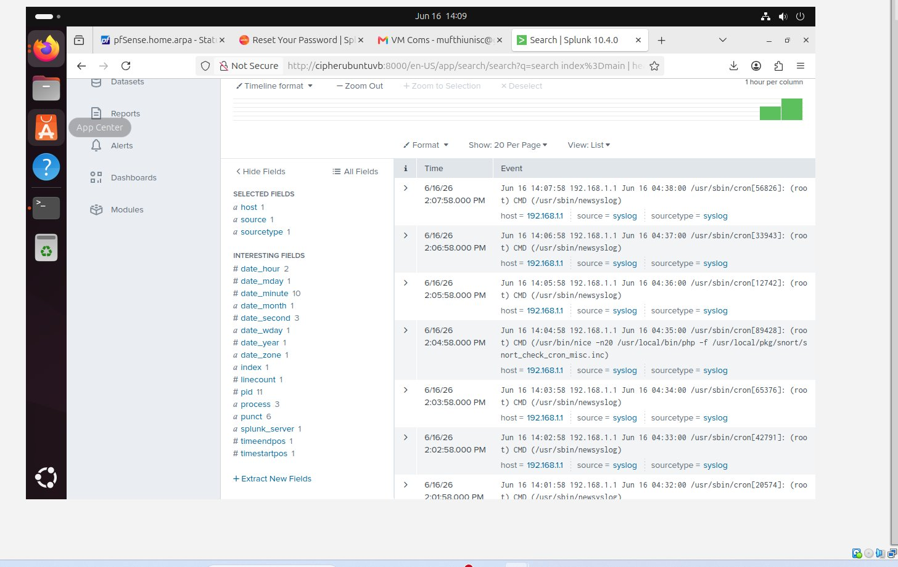
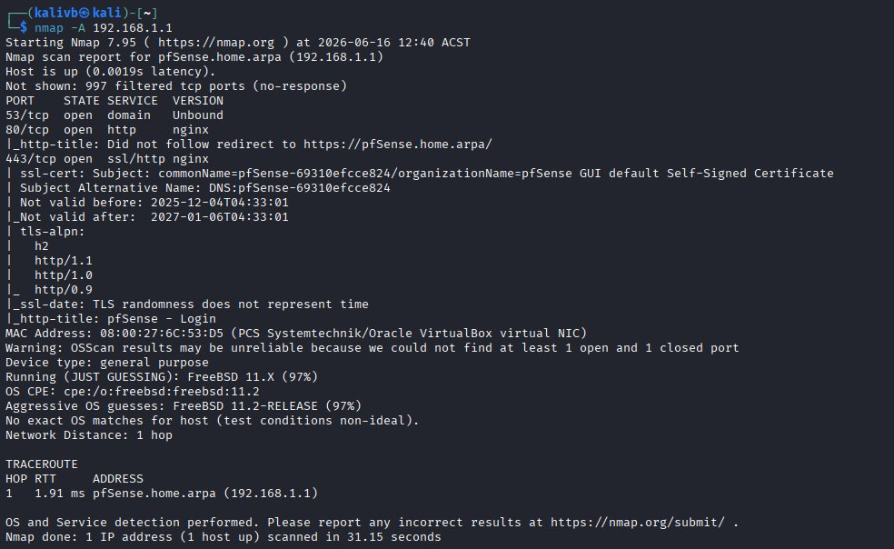
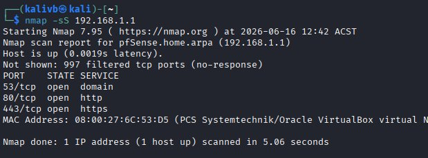
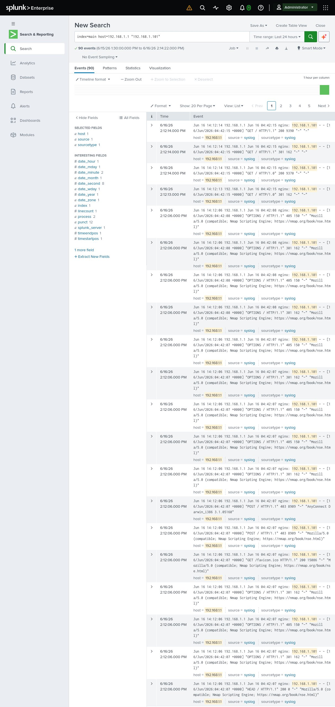
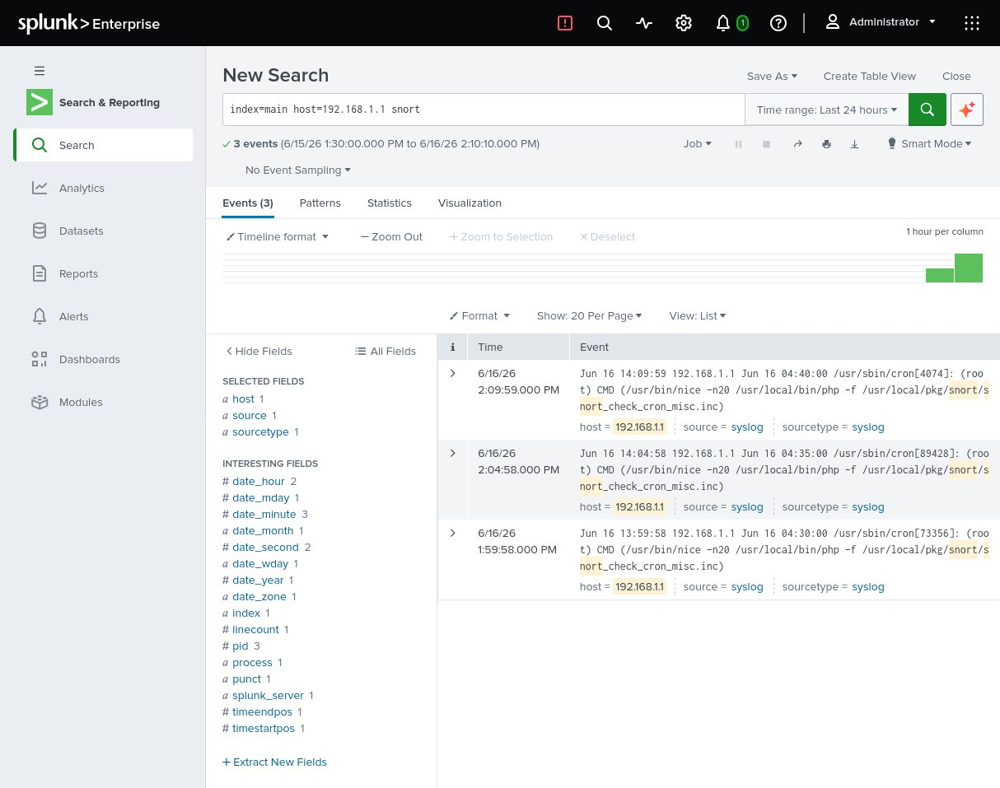
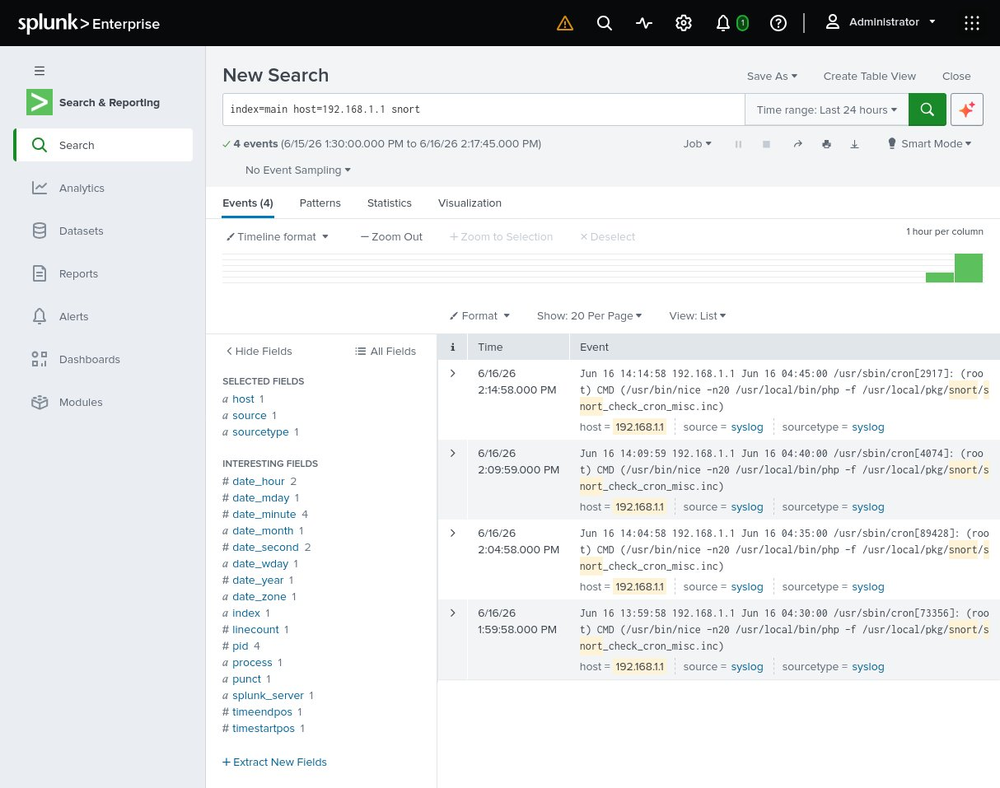

# Exercise 03 — SIEM Integration with Splunk

## Objective
Install Splunk Enterprise on Ubuntu, forward pfSense syslog events into Splunk, and demonstrate real-time detection of Nmap reconnaissance activity launched from Kali Linux.

---

## Lab Environment

| VM | IP | Role |
|---|---|---|
| Kali Linux | 192.168.1.101 | Attacker |
| pfSense | 192.168.1.1 | Firewall / IDS (Snort) |
| Ubuntu | 192.168.1.102 | SIEM host (Splunk) |

---

## Step 1 — Install Splunk on Ubuntu

Downloaded Splunk Enterprise 10.4.0 `.deb` package and installed:

```bash
sudo dpkg -i splunk-10.4.0-f798d4d49089-linux-amd64.deb
sudo /opt/splunk/bin/splunk start --accept-license --run-as-root
sudo /opt/splunk/bin/splunk enable boot-start
sudo ufw allow 8000/tcp
sudo ufw allow 514/udp
```

Splunk web UI accessible at: `http://192.168.1.102:8000`



---

## Step 2 — Configure UDP Syslog Input

In Splunk: **Settings → Data Inputs → TCP/UDP → UDP**

| Setting | Value |
|---|---|
| Port | 514 |
| Source type | syslog |
| Index | main |



---

## Step 3 — Configure pfSense Remote Logging

In pfSense GUI: **Status → System Logs → Settings → Remote Logging**

| Setting | Value |
|---|---|
| Enable Remote Logging | ✅ |
| Remote log server | 192.168.1.102:514 |
| Remote Syslog Contents | Everything |

---

## Step 4 — Verify Logs Flowing into Splunk

```
index=main | head 20
```

pfSense syslog events confirmed flowing in from `192.168.1.1`:



---

## Step 5 — Run Nmap Attack from Kali

```bash
nmap -A 192.168.1.1
nmap -sS 192.168.1.1
```

| Port | Service | Version |
|---|---|---|
| 53/tcp | domain | Unbound DNS |
| 80/tcp | http | nginx |
| 443/tcp | ssl/http | nginx |

- OS detected: FreeBSD 11.2 (96% confidence)
- SSL cert: pfSense self-signed, valid 2025–2027
- HTTP title: `pfSense – Login`
- Network distance: 1 hop, RTT 1.42ms





---

## Step 6 — Detect Attack in Splunk

```
index=main host=192.168.1.1 "192.168.1.101"
```

**Result: 90 events detected** matching the Nmap scan.



### What Splunk Captured

| Field | Value |
|---|---|
| Source IP | 192.168.1.101 (Kali) |
| Destination | 192.168.1.1 (pfSense) |
| User Agent | `Nmap Scripting Engine` |
| HTTP Methods | OPTIONS, GET, POST, HEAD |
| Response codes | 200, 301, 302, 403, 405 |
| Timestamp | 2026-06-16 14:12 ACST |

Snort events also confirmed in Splunk:

```
index=main host=192.168.1.1 snort
```





---

## Security Findings

| # | Finding | Risk | Recommendation |
|---|---|---|---|
| 1 | Nmap Scripting Engine user-agent visible in pfSense nginx logs | Medium | Create Splunk alert to fire on `Nmap Scripting Engine` string |
| 2 | pfSense web GUI accessible from entire LAN | Medium | Restrict GUI to management IP only via firewall rules |
| 3 | 90 events from a single scan in under 2 minutes | Low | Use as baseline threshold for anomaly detection rules |

---

## Outcome

Splunk successfully ingested pfSense syslog data in real time and detected **90 events** from a single Nmap aggressive scan from Kali (`192.168.1.101`). The `Nmap Scripting Engine` user-agent string was clearly visible in nginx access logs — demonstrating full end-to-end SOC visibility across the lab.

---

## Full Lab Stack — Confirmed Operational

| Layer | Tool | IP | Status |
|---|---|---|---|
| Firewall | pfSense | 192.168.1.1 | ✅ Running |
| IDS | Snort | on pfSense | ✅ Alerting |
| SIEM | Splunk 10.4.0 | 192.168.1.102:8000 | ✅ Ingesting logs |
| Attacker | Kali Linux | 192.168.1.101 | ✅ Active |
| Target / SIEM host | Ubuntu 22.04 | 192.168.1.102 | ✅ Running |

---

## Tools Used

- Splunk Enterprise 10.4.0 (Free licence — 500MB/day)
- Nmap 7.95
- pfSense Community Edition
- Snort IDS
- Kali Linux 2024.x
- Ubuntu 22.04 LTS
